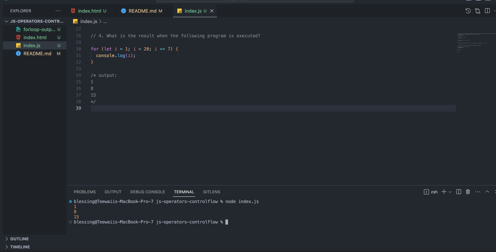

### JavaScript assignment 2 - Q & A
Put the answers to Questions 1, 2 and 4 in a file named readme.md.

#### 1.List the symbols for each of the below Javascript operators
##### 1. Arithmetic Operators
- Addition: +
- Subtraction: -
- Multiplication: *
- Division: /
- Modulus: %
- increment ++
- decrement --
- Exponentiation **

##### 2. Assignment Operators
- Assignment: =
- Addition assignment: +=
- Subtraction assignment: -=
- Multiplication assignment: *=
- Division assignment: /=
- Modulus assignment: %=

##### 3. Comparison Operators
- Equal to: ==
- Not equal to: !=
- Strictly equal to: ===
- Strictly not equal to: !==
- Greater than: >
- Greater than or equal to: >=
- Less than: <
- Less than or equal to: <=

##### 4. Logical Operators
- Logical AND: &&
- Logical OR: ||
- Logical NOT: !

##### 5. Bitwise Operators
- Bitwise AND: &
- Bitwise OR: |
- Bitwise NOT: ~
- Bitwise XOR: ^
- Left shift: <<
- Sign-propagating right shift: >>
- Zero-fill right shift: >>>

#### 2. For each JavaScript Operator, write 2 examples.
##### 1. Arithmetic Operators
- Addition: +
```
(a)
let a = 100;
let b = 25;

let sum = a + b;
let sum = 100 + 25; // sum = 125


(b)
let c = 2.5;
let d = 3.7;

let sum = c + d;
let sum = 2.5 + 3.7; // sum = 6.2
```
- Subtraction: -
```
(a)
let a = 5;
let b = 2;

let difference = a - c;
let difference = 5 - 2; // difference = 3


(b)
let difference = 5.7 - 2.4; // difference = 3.3
```
- Multiplication: *
```
(a)
let product = 2 * 3; // product = 6


(b)
let product = 2.5 * 3.7; // product = 9.25
```
- Division: /
```
(a)
let quotient = 6 / 3; // quotient = 2


(b)
let quotient = 7.5 / 2.5; // quotient = 3
```
- Modulus: %
```
(a)
let remainder = 7 % 3; // remainder = 1


(b)
let remainder = 10 % 2; // remainder = 0
```
- increment ++
```
(a)
let x = 5;
x++;
console.log(x); // Output: 6


(b)
let initialValue = 43;
initialValue++; // same thing as initialValue = initialValue + 1;

console.log("value is " + initialValue); // Output: value is 44
```
- decrement --
```
(a)
let age = 30;
age--;
console.log("New age value is " + age); // Output: New age is 29

(b)
let x = 5;
x--;
console.log(x); // Output: 4

```
- Exponentiation **
```
(a)
let y = 3;
let power = y ** 4;
console.log(power); // Output: 81


(b)
let x = 2;
let result = x ** 3;
console.log(result); // Output: 8
```

##### 2. Assignment Operators
- Assignment: =
```
(a)
let x = 5;


(b)
let y = "hello";
```
- Addition assignment: +=
```
(a)
let x = 2; x += 3; // x = 5


(b)
let message = "Hello "; message += "world!"; // message = "Hello world!"
```
- Subtraction assignment: -=
```
(a)
let x = 5; x -= 2; // x = 3


(b)
let age = 25; age -= 5; // age = 20
```
- Multiplication assignment: *=
```
(a)
let x = 2; x *= 3; // x = 6


(b)
let price = 10; price *= 1.1; // price = 11
```
- Division assignment: /=
```
(a)
let x = 6; x /= 3; // x = 2


(b)
let total = 100; total /= 4; // total = 25
```
- Modulus assignment: %=
```
(a)
let x = 7; x %= 3; // x = 1


(b)
let count = 11; count %= 4; // count = 3
```

##### 3. Comparison Operators
- Equal to: ==
```
(a)
let x = 5; let y = 5; x == y; // true


(b)
let name1 = "Alice"; let name2 = "Bob"; name1 == name2; // false
```
- Not equal to: !=
```
(a)
let x = 5; let y = 7; x != y; // true


(b)
let name1 = "Alice"; let name2 = "Bob"; name1 != name2; // true
```
- Strictly equal to: ===
```
(a)
let x = 5; let y = "5"; x === y; // false


(b)
let x = "hello"; let y = "hello"; x === y; // true
```
- Strictly not equal to: !==
```
(a)
let x = 5; let y = "5"; x !== y; // true


(b)
let x = "hello"; let y = "world"; x !== y; // true
```
- Greater than: >
```
(a)
let x = 5; let y = 3; x > y; // true


(b)
let x = 10;
let y = 5;

if (x > y) {
  console.log(`x + is greater than y');
}
```
- Greater than or equal to: >=
```
(a)
let x = 10;
if (x >= 5) {
  console.log("x is greater than or equal to 5");
} else {
  console.log("x is less than 5");
} // Output: "x is greater than or equal to 5"


(b)
let y = 3;
if (y >= 10) {
  console.log("y is greater than or equal to 10");
} else {
  console.log("y is less than 10");
} // Output: "y is less than 10"
```
- Less than: <
```
(a)
let x = 10;
if (x < 20) {
  console.log("x is less than 20");
} else {
  console.log("x is greater than or equal to 20");
} // Output: "x is less than 20"


(b)
let y = 30;
if (y < 10) {
  console.log("y is less than 10");
} else {
  console.log("y is greater than or equal to 10");
} // Output: "y is greater than or equal to 10"
```
- Less than or equal to: <=
```
let x = 10;
if (x <= 10) {
  console.log("x is less than or equal to 10");
} else {
  console.log("x is greater than 10");
} // Output: "x is less than or equal to 10"


(b)
let y = 30;
if (y <= 10) {
  console.log("y is less than or equal to 10");
} else {
  console.log("y is greater than 10");
} // Output: "y is greater than 10"
```

##### 4. Logical Operators
- Logical AND: &&
```
(a)
let x = 5;
let y = 10;
if (x > 0 && y > 5) {
  console.log("Both conditions are true");
} else {
  console.log("At least one condition is false");
} // Output: "Both conditions are true"


(b)
let a = 2;
let b = 4;
if (a > 0 && b > 5) {
  console.log("Both conditions are true");
} else {
  console.log("At least one condition is false");
} // Output: "At least one condition is false"
```
- Logical OR: ||
```
(a)
let x = 5;
let y = 10;
if (x > 0 || y > 5) {
  console.log("At least one condition is true");
} else {
  console.log("Both conditions are false");
} // Output: "At least one condition is true"


(b)
let num = 25;
if (num < 0 || num > 50) {
  console.log("The number is outside the range of 0 to 50.");
} else {
  console.log("The number is within the range of 0 to 50.");
}
```
- Logical NOT: !
```
(a)
let isRainy = true;
let isNotRainy = !isRainy;
console.log(isNotRainy); // Output: false

(b)
let y = null;
if (!y) {
  console.log("y is falsy");
}
// Output: "y is falsy"
```

##### 5. Bitwise Operators
- Bitwise AND: &
```
5 & 3 = 1


12 & 9 = 8
```
- Bitwise OR: |
```
5 | 3 = 7


12 | 9 = 13
```
- Bitwise NOT: ~
```
~5 = -6


~12 = -13
```
- Bitwise XOR: ^
```
5 ^ 3 = 6


12 ^ 9 = 5
```
- Left shift: <<
```
5 << 1 = 10


12 << 2 = 48
```
- Sign-propagating right shift: >>
```
5 >> 1 = 2


-12 >> 2 = -3
```
- Zero-fill right shift: >>>
```
5 >>> 1 = 2


-12 >>> 2 = 1073741820
```

#### 4. What is the result when the following program is executed?

```
for (let i = 1; i < 20; i +=7) { 
    console.log(i) 
}
```
/* output: 
1
8
15
*/




